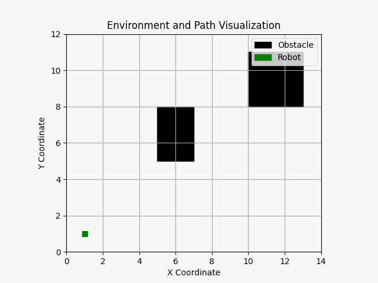
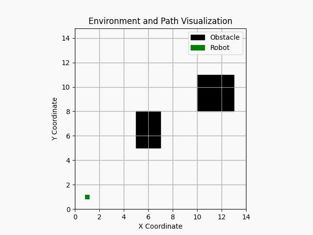
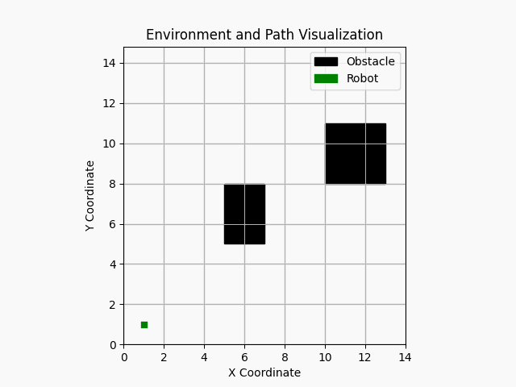

# Reachability-Guided Path Planner

Basic implementation of the Reachability-Guided RRT or RG-RRT motion planner for dynamic systems. In our implementation, we use a pendulum system and a simple car-like system to apply the RG-RRT algorithm. This was implemented as part of the coursework assignment for the RBE 550 course taught at Worcester Polytechnic Institute (WPI).

The **code** repository contains the visualization outputs, along with the main cpp and header files used in the implementation.

    

    

    

